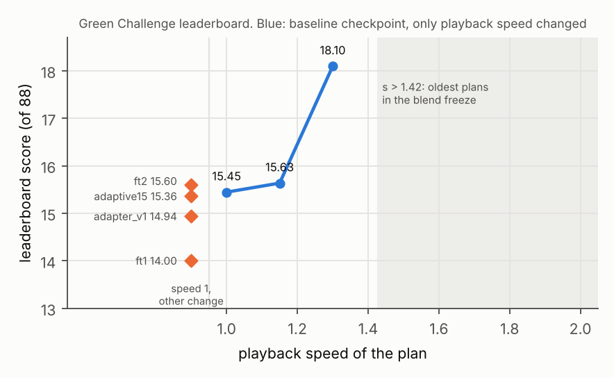
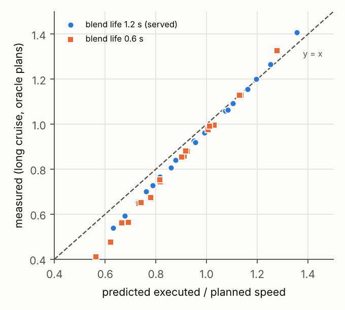
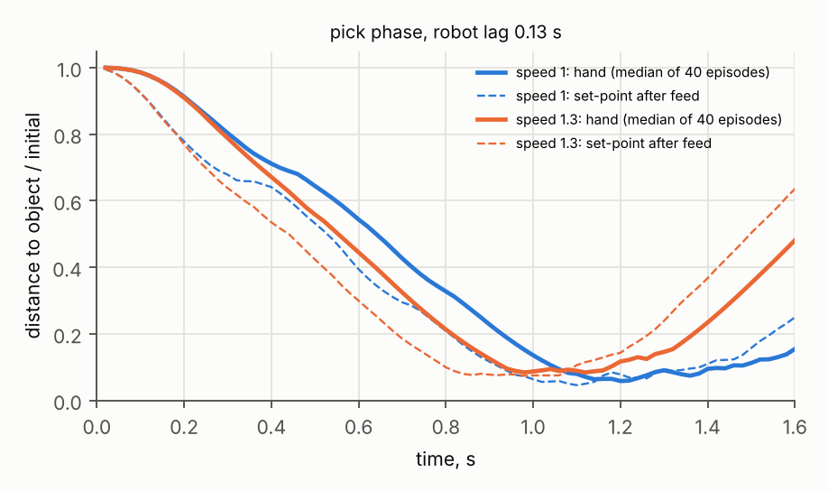
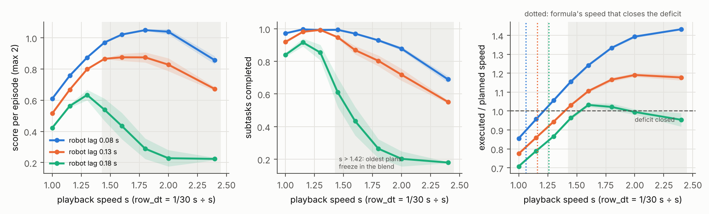
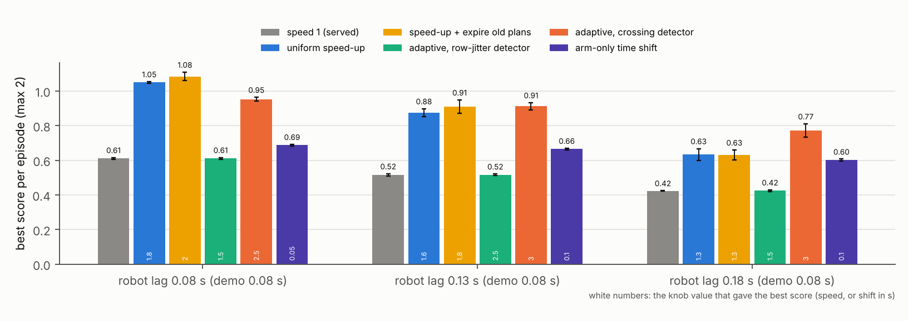
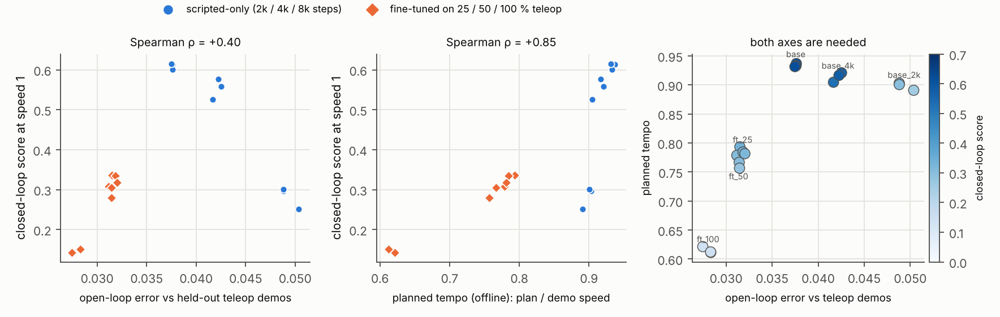

# Дефицит темпа при исполнении чанков VLA

Почему VLA-политика в замкнутом контуре движется медленнее, чем сама планирует, и почему офлайн-ошибка этого не показывает.

Направление: мультимодальные модели сенсомоторной координации для управления манипуляцией (VLA).
Карина Янышевская, ИТМО, ФСУиР, группа R4120 · [karinaya94@gmail.com](mailto:karinaya94@gmail.com) · [t.me/fanoti](https://t.me/fanoti)

## Кратко

Задача выросла из моего участия в Green Challenge (AI Journey 2026, гуманоид Green, бейзлайн на рецепте Green-VLA). Я собрала пайплайн дообучения и сделала два раунда дообучения на данных соревнования. Первый раунд (ft1) снизил офлайн-ошибку на teleop-сценах на 13–44 % в зависимости от группы суставов, но скор на лидерборде упал с 15.44 до 14.0. Второй (ft2, больше эпизодов) вернул скор примерно к уровню бейзлайна, 15.6. Лучший результат, 18.10, дал тот же бейзлайн вообще без обучения, если проигрывать его план в 1.3 раза быстрее.

Моё объяснение такое. Каждый новый план строится от измеренного положения робота, а оно отстаёт от команды на время отслеживания. Слой исполнения усредняет около 15 таких планов (temporal ensembling), и в итоге робот систематически едет медленнее, чем планирует политика. Я называю это дефицитом темпа. Офлайн-ошибка считается при истинных состояниях из датасета и в темпе демонстрации, поэтому этого эффекта в ней нет.

Гипотеза: дефицит можно предсказать по измеримым величинам (средний возраст планов в бленде, отставание робота, опережение действия в демонстрациях). Тогда скорость проигрывания можно рассчитать, а не подбирать сабмитами, а чекпойнты сравнивать по двум числам: ошибке и запланированному темпу.

Проверяла я это на стенде TempoBench: копия подачи действий организаторов, робот с отставанием, flow-matching политика, 3 сида. Дефицит воспроизводится. Когда отставание при исполнении такое же, как в демонстрациях, робот развивает 86 % запланированной скорости, при отставании больше на 0.05 и 0.10 с — 78 и 71 %. Повторяется и история с ft1: дообучение на медленных демо снижает ошибку на них на 15–26 %, а скор падает на 46–75 %. По ошибке против этих демо чекпойнты ранжируются с неправильным знаком (Spearman +0.40), по запланированному темпу с правильным (+0.85). Кроме того, стенд объяснил, почему на лидерборде не помогла адаптивная скорость из SAIL: детектор событий схвата срабатывает на дрожание сэмплированных планов, и на скорости 1× остаётся 99 % строк. С другим детектором адаптивная скорость при большом отставании робота оказалась лучше любого равномерного ускорения.

Как проверить всё это на самой Green Challenge (патч к моему `eval_offline`, зонд темпа по записям рекордера, предсказания для лидерборда), описано в [docs/greensim_protocol.md](docs/greensim_protocol.md).

---

## Содержание

0. [Откуда задача: Green Challenge](#0-откуда-задача-green-challenge)
1. [Что говорит литература](#1-что-говорит-литература)
2. [Открытая проблема: дефицит темпа](#2-открытая-проблема-дефицит-темпа)
3. [Гипотеза и проверяемые предсказания](#3-гипотеза-и-проверяемые-предсказания)
4. [Стенд TempoBench](#4-стенд-tempobench)
5. [Результаты](#5-результаты)
6. [Что это значит для Green Challenge](#6-что-это-значит-для-green-challenge)
7. [Ограничения](#7-ограничения)
8. [Приложение: обход grounding](#8-приложение-обход-grounding)
9. [Как воспроизвести](#9-как-воспроизвести)

---

## 0. Откуда задача: Green Challenge

VLA-политика управляет руками и кистями гуманоида Green по трём камерам и тексту текущей подзадачи. Оценка идёт в симуляторе организаторов: 3 сцены по 8 эпизодов, всего 88 подзадач (4 в сцене с сахарницей, 5 с кольцом, 2 с газировкой). За выполненную подзадачу начисляется примерно `1 − t/T_max`.

Бейзлайн: Qwen3.5-0.8B и flow-matching эксперт действий, чанк из 50 строк по 1/30 с, 10 шагов интегрирования (рецепт Green-VLA / π0).

Слой исполнения (`action_feed.py` организаторов): новый план приходит каждые 0.08 с. Уставка считается как экспоненциально взвешенное среднее всех планов моложе 1.2 с (τ = 1 с, одновременно живут около 15 планов), каждый план берётся в текущий момент по своим часам. После этого скорость и ускорение ограничиваются клампом.

### Что я сделала на соревновании

В публичном коде бейзлайна был только инференс, так что дообучение и всё, что для него нужно, я писала сама.

* **Пайплайн дообучения GreenVLAv1.1 на датасете WBC** (`gch.train`). Данные готовятся через контракт самого чекпойнта: раскладку 51→50 каналов, маски, дельты и нормировку я не переписывала, а взяла из кода сервера. Так модель учится на тех же входах, которые ей потом подаёт симулятор. Функция потерь flow-matching согласована с их сэмплером, и это проверяется тестом: игрушечный эксперт, обученный с моей функцией потерь, восстанавливает цель через неизменённый `sample_actions`, а с перевёрнутым знаком скорости не восстанавливает. Всего в пайплайне 46 тестов.
* **Рассогласование кинематики голеностопов.** В датасете голеностопы записаны в open-представлении, сервер работает в closed, а бейзлайн, судя по конфигу чекпойнта, учился на open. Значит, обучать нужно с `--input-kinematic-space open`, иначе дообучение закрепило бы ошибку в контракте. Инспектор данных это подтверждает: |z| = 0.51 при переводе open → closed и 1.67, если оставить как есть.
* **Обучение эксперта (505M) на 2× T4.** bf16 на T4 только эмулируется, поэтому обучала в fp16. Для этого пришлось написать своё линейное внимание для Qwen3.5 без ядер `fla`: при исходном порядке операций сумма квадратов переполняла fp16, прямой проход портил q/k без каких-либо ошибок, а обратный давал NaN. Ещё понадобились adamw8bit и gradient checkpointing. С bf16 результат совпадает: ошибка 1.1661 против 1.1655.
* **Два раунда дообучения.** ft1: эксперт и адаптер на teleop-сценах darkstore (360 эпизодов) и plate (401) плюс scripted-сцена ring с весом 0.5; 4000 шагов, EMA 0.999, 6.5 ч на 2× T4. ft2 продолжает ft1 на дополнительных teleop-эпизодах и 1000 mimic-эпизодах на сцену. Сабмит собирается как слой с весами (около 1 ГБ дельты) поверх образа организаторов.
* **Слой исполнения и инфраструктура.** Патч к подаче действий организаторов (адаптивная скорость по SAIL) и варианты скорости проигрывания. Локальный бенч в симуляторе организаторов с теми же сидами, что у лидерборда; его я гоняла на своём сервере. Рекордер роллаутов и пайплайн самообучения на удачных подзадачах (по идее стадии R2 из Green-VLA).

### Результаты на лидерборде

Сид 42, оценка детерминированная; чекпойнт везде один и тот же, если не сказано другое.

| вариант | что меняет | скор |
|---|---|---:|
| baseline | ничего | 15.445 |
| fast115 | план проигрывается в 1.15 раза быстрее | 15.635 |
| **fast130** | в 1.3 раза быстрее | **18.096** |
| adaptive15 | перенос в 1.5 раза быстрее, у захвата обычная скорость (как в SAIL) | 15.358 |
| adapter_v1 | коррекция отслеживания суставов от организаторов | 14.936 |
| ft1 | дообучение эксперта и адаптера на teleop-сценах + scripted ring | 14.0 |
| ft2 | продолжение ft1: ещё teleop-эпизоды тех же сцен, 1000 mimic-эпизодов на сцену, ring с весом 0.5 | 15.6 |

Это официальные скоры: каждый вариант я отправляла сабмитом. Непонятно было другое: почему они получились именно такими.

<p align="center"></p>

Офлайн-оценка ft1 (средняя абсолютная ошибка чанка в радианах на отложенных эпизодах, fp16):

| сцена | группа | стоять на месте | бейзлайн | ft1 |
|---|---|---:|---:|---:|
| darkstore | руки, торс, шея | 0.247 | 0.189 | 0.125 |
| plate | руки, торс, шея | 0.227 | 0.169 | 0.095 |
| ring | руки, торс, шея | 0.055 | 0.0128 | 0.0123 |

После соревнования у меня остались два вопроса.

1. Почему модель, которая точнее повторяет демонстрации, хуже решает задачу?
2. Почему один параметр подачи без всякого переобучения дал +17 %, больше любого обучения? И почему равномерное ускорение помогло, а адаптивное из SAIL нет?

Ни лидерборд, ни мой бенч на сервере на них не отвечают: оба показывают итоговый скор, но не причину. К тому же сабмитов было всего 2 в день. С этих вопросов и началась работа.

---

## 1. Что говорит литература

Подробный обзор с цифрами лежит в [docs/literature.md](docs/literature.md), здесь только основное.

* **Офлайн-метрики плохо предсказывают успех.** В [SimplerEnv](https://arxiv.org/abs/2405.05941) на 6 чекпойнтах корреляция validation MSE с реальным успехом r = 0.31, а у оценки в их симуляторе 0.92. Чем дополнить офлайн-ошибку, чтобы она предсказывала успех, авторы не предлагают.
* **Слой исполнения чанков изучают в основном с точки зрения гладкости.** Temporal ensembling из [ACT](https://arxiv.org/abs/2304.13705) — прямой предок подачи организаторов. Дальше идут receding horizon в [Diffusion Policy](https://arxiv.org/abs/2303.04137), [BID](https://arxiv.org/abs/2408.17355) (согласованность против реактивности), [RTC](https://arxiv.org/abs/2506.07339) (задержка и стыки чанков), [Legato](https://arxiv.org/abs/2602.12978) (продолжение чанка внутри политики, меньше колебаний и на 10 % короче время выполнения), [SEAM](https://arxiv.org/abs/2607.04609) (переключение мод на стыках). Все эти работы борются с разрывами между планами. Равномерного замедления, которое появляется, когда каждый план привязан к отстающему измеренному состоянию, я в них не нашла.
* **Скорость исполнения считают либо целью, либо гиперпараметром.** [SAIL](https://arxiv.org/abs/2506.11948) ускоряет исполнение в 3–4 раза и прямо называет отслеживание контроллером одной из проблем. [DemoSpeedup](https://arxiv.org/abs/2506.05064) ускоряет сами демонстрации. В [Green-VLA](https://arxiv.org/abs/2602.00919) датасеты выравнивают по скорости, потому что телеоперация медленнее, а «скорость действий» v на инференсе остаётся гиперпараметром, который «в будущем может выставлять планировщик». Работ, где скорость рассматривается как компенсация дефицита, создаваемого самим слоем исполнения, и где её можно предсказать без прогонов робота, я не нашла.

---

## 2. Открытая проблема: дефицит темпа

План $k$ строится по наблюдению в момент $t_k$ как дельты к измеренному положению $x(t_k)$. В демонстрациях команда опережала состояние на время отслеживания демо-робота $\delta_d$, поэтому выученный план с самого начала на $v\,\delta_d$ впереди текущего положения и дальше движется со скоростью $v$. Слой исполнения берёт взвешенное среднее прогнозов живых планов на текущий момент, а при ускорении $s$ строки идут в $s$ раз чаще:

$$c(t)=\sum_k w_k\big[x(t-a_k)+v\,\delta_d+s\,v\,(a_k-\ell)\big],\qquad x(t)=c(t-\delta_s),$$

где $a_k$ — возраст плана, $\ell$ — `lead`, $\delta_s$ — отставание робота при развёртывании. Для установившегося движения $x=x_0+ut$ получается

$$\boxed{\;\frac{u}{v}=\frac{\delta_d+s\,(\bar a-\ell)}{\bar a+\delta_s}\;}\qquad\Rightarrow\qquad s^{\ast}=\frac{\bar a+\delta_s-\delta_d}{\bar a-\ell},$$

где $\bar a=\mathbb E_w[a_k]$ — средний возраст планов в бленде. Для подачи организаторов (lead 0.03 с, период 0.08 с, жизнь плана 1.2 с, τ = 1 с, строки по 1/30 с) $\bar a = 0.527$ с.

Из формулы следует несколько вещей.

* Дефицит есть даже при одинаковых отставаниях ($u/v<1$ из-за `lead`) и растёт с разницей $\delta_s-\delta_d$. На Green Challenge у этой разницы несколько источников: телеоперация с другим отставанием, кламп ускорения в подаче (в демонстрациях его не было), другая динамика симулятора.
* Бленд дефицит уменьшает, а не создаёт. Организаторы пишут в комментарии к коду, что усреднение прогнозов не добавляет фазового отставания. По формуле видно даже больше: бленд растягивает $\bar a$ и за счёт этого уменьшает дефицит. Без бленда ($\bar a\approx 0.1$ с) перепланирование от отстающего состояния даёт колебания и упор в кламп. С этим согласуется их собственное измерение: с жизнью плана 1.2 с результат лучше, чем с 0.78 с (73.2 % против 64.7 %).
* Офлайн-ошибка ничего из этого не учитывает. План сравнивается с демонстрацией при истинном состоянии из датасета и в темпе демонстрации, так что ни $\bar a$, ни $\delta_s$ в неё не входят.
* Дообучение может сдвинуть темп так, что по ошибке этого не будет видно. Если демонстрации медленнее (авторы Green-VLA прямо пишут это про телеоперацию) или в них другое опережение, план становится медленнее, хотя геометрически точнее.

Открытый вопрос, таким образом: как оценивать и настраивать VLA, чтобы темп, который реально развивает робот, можно было измерить и задать заранее, а не получать как побочный эффект подбора `row_dt` по лидерборду.

---

## 3. Гипотеза и проверяемые предсказания

Гипотеза: заметная часть разрыва между офлайн-ошибкой и успехом в замкнутом контуре объясняется дефицитом темпа. Дефицит определяется слоем исполнения и отставаниями, и его можно предсказать без прогонов. На практике это значит, что (а) скорость проигрывания можно рассчитать и (б) чекпойнты нужно сравнивать по двум величинам: офлайн-ошибке и запланированному темпу.

| | Предсказание | Что его опровергнет |
|---|---|---|
| H1, механизм | Измеренное отношение исполненной скорости к запланированной совпадает с формулой из §2 | Систематическое расхождение больше ~10 % в установившемся режиме |
| H2, форма кривой | Скор растёт с ускорением, пока дефицит не закрыт, потом падает: застывшие планы при s > 1.42, кламп, слишком ранний захват. Порог 1.42 следует из параметров подачи | Монотонный рост или спад, не связанный с порогом |
| H3, оценка моделей | Дообучение на более медленных демо снижает офлайн-ошибку на этих демо, но снижает и запланированный темп, и скор. На наборе чекпойнтов темп ранжирует скор лучше, чем ошибка | Ошибка ранжирует не хуже темпа |
| H4, калибровка | Скорость, рассчитанная по измеримым величинам, близка к лучшей скорости из перебора | Калибровка проигрывает перебору больше, чем разброс между сидами |

---

## 4. Стенд TempoBench

В симуляторе Green Challenge нельзя по отдельности менять то, что важно для гипотезы: отставание робота, темп демонстраций, состав данных для дообучения. К тому же каждая точка там стоит прогона на GPU. Поэтому основной эксперимент я делала на отдельном стенде, где есть только те части системы, к которым относится гипотеза, а всё остальное по возможности упрощено. Как проверять на самом симуляторе, описано в §6.

| Компонент | Как сделано | Что соответствует на Green Challenge |
|---|---|---|
| Подача действий | Векторизованная копия `action_feed.py` организаторов: расписание строк по времени, ожидание первой строки, бленд с экспоненциальными весами, жизнь плана 1.2 с, застывание старых планов, кламп скорости и ускорения | Параметры по умолчанию те же (`lead` 0.03, период 0.08, τ 1.0, жизнь 1.2, 50 строк по 1/30 с) |
| Робот | Точка на плоскости и схват; уставку отслеживает критически демпфированный контур 2-го порядка, отставание δ = 2/ω | Суставной PD-контроллер с отставанием |
| Задача | Две подзадачи: взять (закрыть схват не дальше 3 см от объекта) и положить (открыть не дальше 4 см от цели). Таймауты = 1.15 × 90-й перцентиль времени эксперта. Скор за подзадачу `1 − t/T` | Скоринг Green Challenge |
| Демонстрации | Скриптовый «оператор» в пространстве команд, 30 Гц: разгон, крейсерская скорость, торможение, схват закрывается, когда рука остановилась. Scripted: темп 1, δ = 0.08 с. Teleop: темп 0.72 ± 25 %, δ = 0.13 с, случайные паузы | Scripted- и teleop-части WBC-датасета |
| Политика | Flow-matching чанк-политика (MLP 4 × 512): 50 строк по 1/30 с, дельты к наблюдаемому положению, 10 шагов Эйлера | Рецепт эксперта Green-VLA / π0 |
| Оракул | Эксперт, прокрученный на 50 кадров вперёд от текущего состояния, то есть политика без ошибок обучения | — |

Эксперименты:

* E1: проверка формулы на длинных переносах (оракул, без клампа), 4 отставания × 5 скоростей × 2 значения жизни плана.
* E2: кривые скорости для обученной политики, 3 отставания робота × 8 скоростей. Отдельно сравниваются застывание и истечение старых планов, адаптивная скорость в стиле SAIL и сдвиг по времени только для руки.
* E3: аналог ft1. На каждый сид 6 чекпойнтов: обученные только на scripted (2k, 4k и 8k шагов) и дообученные от последнего на смеси с 25, 50 и 100 % teleop. Для каждого считаются офлайн-ошибка на teleop и на scripted, запланированный темп и скор в замкнутом контуре.
* E4: калибровка. Скорость = (компенсация подачи по формуле) / (запланированный темп модели), её сравниваю с лучшей скоростью из перебора.

---

## 5. Результаты

Все числа усреднены по 3 сидам обучения (данные одни и те же, отличаются инициализация и порядок батчей), 300 эпизодов на точку. Полные таблицы — в [figures/results_tempo.md](figures/results_tempo.md).

### 5.1 H1: формула и механизм

<p align="center"> </p>

* **E1, длинные переносы, оракул без клампа.** Измеренное отношение исполненной скорости к запланированной совпадает с формулой из §2: при жизни плана 1.2 с среднее отклонение −0.033, максимальное 0.093 (20 точек: 4 отставания × 5 скоростей). При жизни 0.6 с формула систематически завышает темп (−0.062, максимум 0.154).
* **E2, задача, обученная политика.** На скорости 1 робот развивает 0.86, 0.78 и 0.71 от запланированной скорости при отставании 0.08 (как в демо), 0.13 и 0.18 с. Дефицит закрывается при s = 1.22, 1.40 и 1.53, а формула даёт 1.06, 1.16 и 1.26. Направление и порядок величины формула предсказывает верно, но на коротких движениях (около 1 с при памяти бленда 1.2 с) добавляется переходный дефицит. Поэтому формулу стоит считать нижней границей нужной скорости, а на реальной системе темп лучше мерить напрямую (зонд из §6).
* **E1b, роль бленда (сид 0).** Чем дольше живут планы в бленде, тем меньше дефицит и выше скор, причём и у оракула, и у обученной политики. При отставании 0.08 с без бленда скор 0.31 и темп 0.78, при жизни 0.4, 0.8 и 1.2 с скор 0.43, 0.58 и 0.61, темп 0.81, 0.85 и 0.86. Организаторы получили то же направление на своей задаче (1.2 с лучше 0.78 с).
* **E2c, кламп.** Ограничитель ускорения срабатывает почти на каждом тике (срезает дрожание между соседними стохастическими планами), но если его выключить, темп почти не меняется: 0.847 против 0.855 на скорости 1.

H1 подтверждается для установившегося движения, на коротких движениях дефицит больше, чем по формуле.

### 5.2 H2: форма кривой скорости

<p align="center"></p>

* Скор растёт с ускорением: с 0.61 до 1.05 при s = 1.8 и совпадающем отставании, с 0.52 до 0.88 при отставании 0.13 с, с 0.42 до 0.63 при 0.18 с.
* Оптимум лежит дальше точки, где дефицит закрывается (s = 1.8 против 1.22). Оценка награждает за время (`1 − t/T`), и политике выгодно ехать быстрее демонстраций, как в SAIL и DemoSpeedup.
* Чем больше отставание, тем раньше начинается спад (оптимум 1.8, 1.6 и 1.3). Ускорение сдвигает и момент закрытия схвата, а сильно отстающая рука к этому моменту ещё не доехала, поэтому растёт число промахов при захвате.
* Порог застывания s > 1.42 есть, но в стенде почти ни на что не влияет: вариант, где старые планы истекают, лучше всего на 0–0.03. Эта часть H2 не подтвердилась, спад определяется захватом, а не порогом.

### 5.3 Почему не сработала адаптивная скорость

<p align="center"></p>

Адаптивная скорость в стиле SAIL (как в моём патче: строки рядом с событием схвата идут на 1×, остальные быстрее) в стенде даёт побитово тот же результат, что скорость 1, при любом коэффициенте от 1.5 до 3.0. Дело в детекторе событий:

| доля строк, помеченных как захват или отпускание | детектор по ходу между соседними строками (как в патче) | детектор по пересечению уровня 0.5 |
|---|---:|---:|
| демонстрационные чанки | 2.3 % | 2.3 % |
| сэмплированные планы политики | **59.9 %** | 2.8 % |

На демонстрациях оба детектора помечают одни и те же строки. Но сэмплированные flow-планы дрожат, и построчный детектор срабатывает на 60 % строк. С окном ±10 строк на скорости 1× остаётся 99 % строк, то есть адаптивная скорость фактически выключена. На лидерборде картина такая же: adaptive15 дал 15.358 при 15.445 у бейзлайна. В комментарии к моему патчу стоит оценка «пальцы двигаются в 10–20 % кадров», но её я снимала с демонстраций, а не с планов модели.

С детектором по пересечению уровня 0.5 адаптивная скорость работает: на 1× остаётся 48–50 % строк, успех держится в пределах 0.87–1.00. При большом отставании это лучший из всех вариантов: 0.77 против 0.63 у лучшего равномерного ускорения. При совпадающем отставании он немного проигрывает (0.95 против 1.05). Сдвиг плана руки по времени без ускорения помогает слабо и быстро начинает ломать захват.

### 5.4 H3: оценка моделей (аналог ft1)

<p align="center"></p>

| чекпойнт | ошибка vs teleop-демо | ошибка vs scripted-демо | запланированный темп | успех @1 | скор @1 |
|---|---:|---:|---:|---:|---:|
| base_2k | 0.0493 | 0.0370 | 0.90 | 0.50 | 0.28 |
| base_4k | 0.0422 | 0.0256 | 0.91 | 0.92 | 0.55 |
| base (только scripted) | 0.0376 | 0.0178 | 0.93 | 0.97 | 0.61 |
| ft_25 (дообучен, 25 % teleop) | 0.0318 | 0.0266 | 0.79 | 0.68 | 0.33 |
| ft_50 | 0.0313 | 0.0278 | 0.77 | 0.63 | 0.30 |
| ft_100 | 0.0280 | 0.0382 | 0.62 | 0.41 | 0.15 |

* Как и с ft1, дообучение на медленных демо снижает ошибку на этих демо на 15–26 %, а скор падает на 46–75 %. Модель с лучшей офлайн-ошибкой (ft_100) оказывается худшей в замкнутом контуре.
* Ранговая корреляция со скором по 18 точкам (6 чекпойнтов × 3 сида): у ошибки против teleop-демо +0.40, то есть знак неправильный; у запланированного темпа +0.85; у ошибки против scripted-демо −0.97.
* Последняя цифра ограничивает вывод. Если считать ошибку против демонстраций в том темпе, который нужен для оценки, она ранжирует модели очень хорошо. Но для teleop-сцен Green Challenge (darkstore, plate) других демонстраций, кроме медленных teleop, у меня не было, а темп относительно бейзлайна можно посчитать и без них.
* Один только темп не замечает недообученность: у base_2k темп нормальный, а скор низкий. Поэтому нужны обе величины (правая панель графика).

### 5.5 H4: калибровка скорости

Рассчитанная скорость = компенсация подачи по формуле (1.06) / запланированный темп модели. Для дообученных моделей она даёт 82–93 % того выигрыша, который получается перебором скоростей (ft_100: 0.15 → 0.51 при лучшем 0.53). Для base только 29 %, потому что скор растёт и после закрытия дефицита (§5.2). Получается, что калибровка делает то, для чего задумывалась, то есть возвращает потерянное на темпе. Но оптимальная скорость больше, и её определяет баланс между выигрышем по времени и промахами при захвате.

Какая часть потерь ft объясняется темпом? На скорости 1 base опережает ft_25 на 0.28, а если каждому дать его рассчитанную скорость, то на 0.18. Значит, на темп приходится около трети потерь ft_25 и около половины у ft_100. Остальное приходится на геометрию: ошибка на scripted-сценах у ft выше на 49–115 %.

### 5.6 Итог по гипотезам

| | Итог |
|---|---|
| H1, механизм | Подтверждена в установившемся режиме (±0.03–0.09); на коротких движениях формула даёт нижнюю границу |
| H2, форма кривой | Частично: перевёрнутая U есть, но спад определяется захватом, а не порогом застывания |
| H3, оценка моделей | Подтверждена в той постановке, что была у меня на соревновании (ошибка против медленных демо): темп ранжирует, ошибка нет |
| H4, калибровка | Частично: возвращает 82–93 % потерь дообученных моделей, но оптимум не находит |
| Дополнительно | Адаптивная скорость выключается из-за дрожания планов; с детектором по пересечению это лучший вариант при большом отставании |

---

## 6. Что это значит для Green Challenge

В левой колонке измерения с официального лидерборда. Объяснения в средней колонке получены на стенде, на реальном чекпойнте их ещё надо проверить.

| что измерено на лидерборде | объяснение по стенду (гипотеза) | чем проверить |
|---|---|---|
| fast130: +17 % без переобучения | закрытие дефицита темпа (в стенде при совпадающем отставании дефицит 14 %, закрывается при s ≈ 1.2) | зонд C: темп на 1.0 и 1.3 по записям рекордера |
| adaptive15 ≈ бейзлайн | детектор событий срабатывает на дрожание планов, и адаптивная скорость не включается | патч A2: доля строк, оставленных на 1×, в планах бейзлайна |
| ft1: офлайн лучше, скор хуже | дообучение на медленных teleop-демо снизило темп плана, а ошибка против тех же демо этого не видит | патч A: темп ft1 относительно бейзлайна на одних и тех же кадрах |

Если A2 подтвердится, я бы отправила на лидерборд адаптивную скорость 1.5–2.0 с исправленным детектором (`--feed.adaptive-detector net`, патч [`greensim/action_feed_net_events.patch`](greensim/action_feed_net_events.patch)) и поднятым пределом ускорения. Если A покажет, что у дообученного чекпойнта темп k относительно бейзлайна, его нужно отправлять со скоростью около 1.3 / k, а не 1.3.

Отдельно стоит понять, за счёт чего выиграл fast130. В скоре `1 − t/T` ускорение может давать очки двумя путями: через время и через число выполненных подзадач. В стенде обученная политика почти всегда успевает, так что выигрыш идёт в основном через время. На Green Challenge эти два пути можно разделить по разбивке `results.json` бенча по подзадачам, и начать я бы предложила именно с этого.

Протокол с командами лежит в [docs/greensim_protocol.md](docs/greensim_protocol.md):

* **A. Офлайн (Kaggle 2× T4, около 4 ч).** Патч [`greensim/eval_offline_tempo.patch`](greensim/eval_offline_tempo.patch) добавляет в мой `gch.eval_offline` запланированный темп по группам суставов. Ожидаю, что у ft1 он ниже, чем у бейзлайна.
* **B. Данные (CPU).** `gch.inspect_wbc` уже считает, на сколько кадров `action` опережает `state`. Это $\delta_d$ для формулы, отдельно для scripted и teleop.
* **C. Симулятор (мой бенч на сервере).** [`greensim/tempo_probe.py`](greensim/tempo_probe.py) по записям рекордера (`GC_RECORD_DIR`) считает темп в замкнутом контуре относительно демонстраций, обращает формулу и выдаёт отставание симулятора и скорость, которая закрывает дефицит.
* **D. Лидерборд.** Сабмиты в порядке убывания ожидаемой пользы: адаптивная скорость с исправленным детектором, калиброванная скорость для дообученных чекпойнтов, вариант с истечением старых планов при s > 1.42.

---

## 7. Ограничения

* Стенд сильно упрощён: точка на плоскости вместо 50 суставов, нет камер (политика работает по состоянию), задача из двух подзадач. Он воспроизводит слой исполнения и отставание, но не перцепцию и не механику контакта (захват там просто геометрическое условие). Скоры Green Challenge измерены на лидерборде, а гипотезой остаётся объяснение их причин. Для его проверки и нужен протокол из §6.
* Формула выведена для установившегося движения. На коротких перемещениях есть ещё переходный дефицит (§5, E1–E2), который она недооценивает, поэтому калибровка по формуле даёт нижнюю оценку нужной скорости.
* В TempoBench обученная политика почти всегда успевает, и выигрыш от ускорения идёт в основном через `1 − t/T`. Что дал fast130 на Green Challenge, больше выполненных подзадач или те же подзадачи быстрее, пока неизвестно. Это покажет разбивка `results.json` бенча по подзадачам для baseline и fast130.
* Teleop в стенде медленнее по построению (темп 0.72), так что замедление политики после дообучения на нём само по себе ожидаемо. Проверялось другое: что офлайн-ошибка это замедление пропускает, а офлайн-темп ловит.
* На реальной модели механизм пока не проверен. Скоры лидерборда и бенча настоящие, но патч A и зонд C, которые проверяют объяснение на чекпойнте, написаны для этой работы и ещё не запускались. Офлайн-часть запускается на сервере одной командой ([`greensim/server_check.sh`](greensim/server_check.sh)), для зонда C нужен прогон бенча с включённым рекордером.

---

## 8. Приложение: обход grounding

До того как я подняла логи чемпионата, я занималась другим направлением: не тем, как быстро едет action head, а тем, куда он едет. Полное описание с обзором, гипотезой, стендом и протоколом — в [appendix_anchor/README.md](appendix_anchor/README.md).

* **Проблема.** На узких демонстрациях у action head есть два одинаково хороших для BC способа попасть в цель: найти названный объект или поехать туда, где он обычно лежал. По свежим работам модели выбирают второй. В [LIBERO-PRO](https://arxiv.org/abs/2510.03827) успех падает с >90 % до 0 % при сдвигах, а выход почти не меняется даже при бессмысленной инструкции. В [Robust Skills, Brittle Grounding](https://arxiv.org/abs/2602.24143) у SmolVLA 90 % превращаются в 2 % при случайной раскладке, и рост данных с 10k до 100k демо не помогает. Существующие способы подать grounding в управление (инъекция точки, оверлеи, guidance вроде JPM в Green-VLA) добавляют сигнал, но обходной путь у модели остаётся.
* **Гипотеза (anchor frame).** Сделать точку указания системой координат action head: он видит только вырезку вокруг точки и позу схвата относительно неё, без глобального кадра и абсолютных координат. Тогда поехать «на обычное место» модель просто не может.
* **Стенд AnchorBench.** 7 методов × 6 сценариев (в распределении, новые позиции, новые сочетания «цвет × форма», перестановка мест, пустой стол, смена фона), 1 сид, причинные пробы с подменой точки и с ошибкой указателя.
* **Результаты.** Anchor frame даёт 0.96 на новых позициях и 0.91 на новых сочетаниях против 0.12 и 0.08 у BC и 0.50 и 0.42 у инъекции той же точки. Если подменить точку на дистрактор, anchor frame следует точке в 73 % эпизодов (инъекция в 39 %). Контрольная абляция опровергла мою исходную формулировку: глобальный кадр можно оставить, важна форма, в которой приходит grounding, то есть поза относительно точки плюс локальная вырезка. Смена фона (0.41) и отказ, когда цели на столе нет, остались нерешёнными.

В обоих направлениях дело оказалось не в размере модели, а в том, что видит action head и как исполняются его планы. И то и другое можно проверить на Green-VLA с инструментами, которые у меня уже есть.

---

## 9. Как воспроизвести

```bash
pip install -r requirements.txt
pytest -q tests/
python scripts/tempo_experiments.py --seeds 0 1 2 --out results_tempo    # E1–E4, ~45 мин на 2 ядрах CPU
python scripts/tempo_extra.py --seeds 0 1 2 --res results_tempo         # E1b, E2b, E2c, ~10 мин
python scripts/tempo_figures.py --res results_tempo --out figures
# приложение (AnchorBench)
python appendix_anchor/scripts/run_experiment.py --seeds 0 --out appendix_anchor/results
python appendix_anchor/scripts/make_figures.py --res appendix_anchor/results --out appendix_anchor/figures
```

```
tempobench/        world.py (робот, задача, эксперт), feed.py (копия подачи + формула), policy.py (flow-политика, оракул), closed_loop.py
scripts/           tempo_experiments.py (E1–E4), tempo_extra.py (E1b, E2b, E2c), tempo_figures.py
results_tempo/     все метрики в JSON
figures/           графики и results_tempo.md
greensim/          tempo_probe.py, eval_offline_tempo.patch, action_feed_net_events.patch — проверка на Green Challenge
data/leaderboard.json   мои скоры на лидерборде
docs/              literature.md, greensim_protocol.md
appendix_anchor/   второе направление (AnchorBench), со своим README
tests/             проверки стенда
```

Стенд TempoBench написан на JAX и считается на CPU. Для дообучения Green-VLA, бенча в симуляторе и проверки на реальном чекпойнте (`greensim/`) нужен GPU.


<!-- TODO(Карина): проверь и перепиши этот абзац своими словами -->
**Об использовании ИИ.** Как разрешено в задании, ИИ-ассистент (Claude) использовался для поиска и чтения статей, как ко-пайлот при написании кода и при оформлении репозитория.
