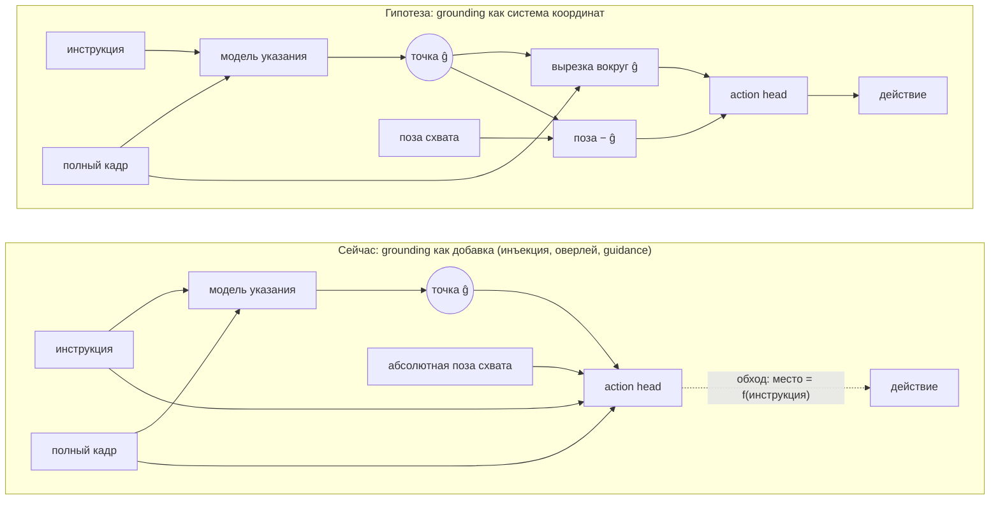
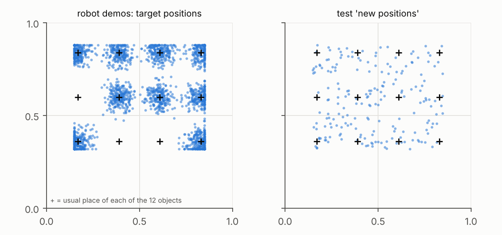
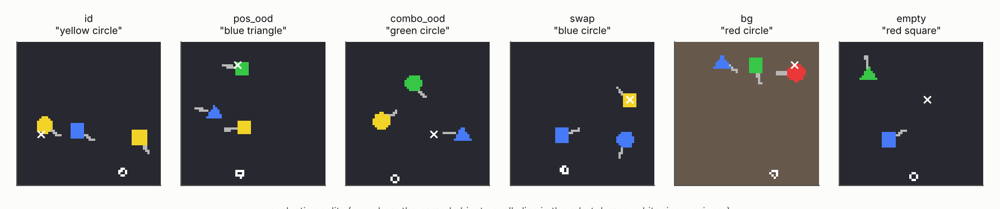
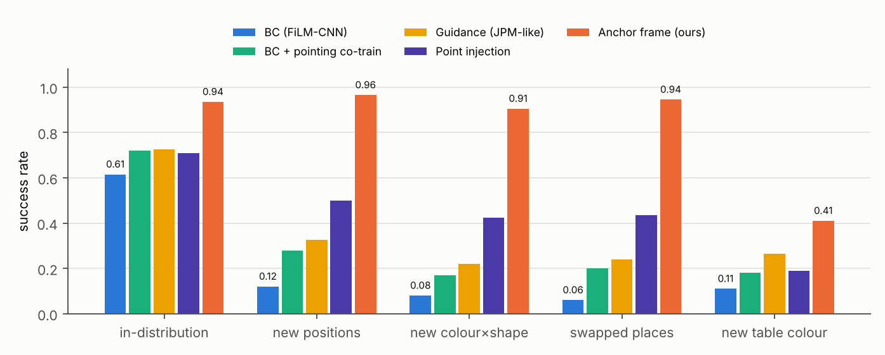
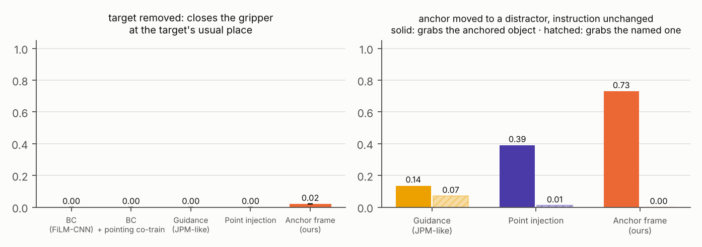
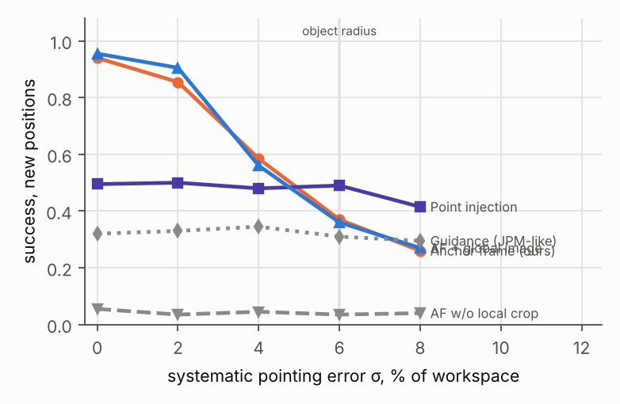

# Приложение. Точка указания как система координат для action head

Почему VLA после дообучения на узких данных едет туда, где объект обычно лежал, а не туда, где он лежит сейчас.

Это второе направление к основной работе ([../README.md](../README.md)). Основная работа про темп исполнения, а здесь речь о том, куда едет action head.

## Кратко

При дообучении VLA на узком наборе демонстраций у action head есть два одинаково хороших для behaviour cloning способа попасть в цель: найти названный объект или поехать туда, где он обычно лежал в демо. Свежие работы показывают, что модели выбирают второй ([LIBERO-PRO](https://arxiv.org/abs/2510.03827), [LIBERO-Plus](https://arxiv.org/abs/2510.13626), [Robust Skills, Brittle Grounding](https://arxiv.org/abs/2602.24143)). Существующие способы подать grounding в управление (инъекция точки, оверлеи на кадр, guidance как JPM в [Green-VLA](https://arxiv.org/abs/2602.00919)) добавляют сигнал, но обходной путь у модели остаётся. Я называю это обходом grounding (grounding bypass).

Гипотеза: сделать точку указания (anchor) системой координат action head. Он видит только вырезку изображения вокруг точки и позу схвата относительно неё, без глобального кадра и абсолютных координат. Тогда поехать «на обычное место» модель не может, обобщение по позициям получается из эквивариантности по построению, а обобщение на новые сочетания признаков зависит от указателя, который учится на широких веб-данных.

Проверяла на стенде AnchorBench, где «узость» данных задаётся точно: 7 методов × 6 сценариев × 1 сид (2 000 демо, 200 эпизодов на сценарий) и две причинные пробы, подмена точки и систематическая ошибка указателя. Anchor frame даёт 0.96 на новых позициях и 0.91 на новых сочетаниях «цвет × форма» против 0.12 и 0.08 у BC и 0.50 и 0.42 у инъекции той же точки. Контрольная абляция опровергла мою исходную формулировку: закрывать глобальный канал не обязательно, важно подать точку в относительных координатах вместе с локальной вырезкой (§5).

Протокол и скрипты, чтобы проверить те же величины на манипуляторе (реальном или в симуляторе) с Green-VLA, — в [docs/real_robot_protocol.md](docs/real_robot_protocol.md).

---

## Содержание

0. [Откуда задача](#0-откуда-задача)
1. [Что говорит литература](#1-что-говорит-литература)
2. [Открытая проблема: grounding bypass](#2-открытая-проблема-grounding-bypass)
3. [Гипотеза и проверяемые предсказания](#3-гипотеза-и-проверяемые-предсказания)
4. [Эксперимент: AnchorBench](#4-эксперимент-anchorbench)
5. [Результаты](#5-результаты)
6. [Что это значит для Green-VLA и реального робота](#6-что-это-значит-для-green-vla-и-реального-робота)
7. [Ограничения](#7-ограничения)
8. [Как воспроизвести](#8-как-воспроизвести)

---

## 0. Откуда задача

На Green Challenge инструкцией для модели служит текст подзадачи, который присылает симулятор, а на дообучение у меня было 300–400 эпизодов на сцену. Это как раз режим «узкие демонстрации и язык как единственный указатель цели», в котором свежие работы находят обход grounding (§1). Лидерборд не показывает, на каких подзадачах модель проваливается, поэтому я не утверждаю, что на чемпионате ломалось именно это. Направление мотивировано литературой и устройством Green-VLA, где модуль указания (JPM) уже есть, но используется только как guidance.

С основной темой его связывает то, что обе проблемы возникают между тем, что модель знает, и тем, как это исполняется. В основной теме скорость, которую планирует политика, теряется в слое исполнения. Здесь модель указания знает, где объект, но action head может этим знанием не пользоваться.

---

## 1. Что говорит литература

Подробный разбор 17 работ с цифрами — в [docs/literature.md](docs/literature.md), здесь основное.

Проблема наблюдается в нескольких независимых работах, и масштаб данных её не решает.

* [LIBERO-PRO](https://arxiv.org/abs/2510.03827): модели с >90% на LIBERO падают до 0% при изменении объектов, начальных состояний и инструкций. Выход почти не меняется даже при бессмысленной инструкции, а при подмене целевого объекта модель всё равно выполняет захват.
* [LIBERO-Plus](https://arxiv.org/abs/2510.13626): из 7 видов возмущений сильнее всего бьют ракурс камеры и начальное состояние робота (95% → <30%); модели склонны игнорировать язык.
* [Shortcut Learning in Generalist Robot Policies](https://arxiv.org/abs/2508.06426): причина в shortcut learning из-за низкого разнообразия внутри поддатасетов и их фрагментации; аугментации помогают π0.
* [Robust Skills, Brittle Grounding](https://arxiv.org/abs/2602.24143): SmolVLA даёт 90% при малом джиттере и 2% при случайной раскладке; на невиданных парах «объект × область» 44% → 0%; рост данных с 10k до 100k не помогает. Сам захват устойчив, ломается выбор цели. Решения авторы не предлагают и называют открытым вопросом объектно-центричные представления, обусловленные языком.

Как сейчас передают grounding в действие:

| Способ | Примеры | Куда попадает сигнал | Остаются ли у action head глобальный кадр и абсолютные координаты |
|---|---|---|---|
| Ко-обучение на указаниях / VQA | [Green-VLA](https://arxiv.org/abs/2602.00919) L1, [π0.5-KI](https://arxiv.org/abs/2505.23705), [InternVLA-M1](https://arxiv.org/abs/2510.13778) | в веса бэкбона | да |
| Промежуточное рассуждение | [ECoT](https://arxiv.org/abs/2407.08693), [MolmoAct](https://arxiv.org/abs/2508.07917) | токены перед действием | да |
| Рисунок поверх кадра | [TraceVLA](https://arxiv.org/abs/2412.10345), [PEEK](https://arxiv.org/abs/2509.18282) | пиксели входа | да |
| Инъекция точки в action head | [Tsai et al. 2026](https://arxiv.org/abs/2606.27663) | дополнительный вход головы | да |
| Guidance на инференсе | JPM в Green-VLA | поправка к полю скоростей flow-matching | да |
| Объектно-центричный фронтенд | [OBEYED-VLA](https://arxiv.org/abs/2512.22519) | маскирование входа | частично |
| Эквивариантные политики | [EquiDiff](https://arxiv.org/abs/2407.01812), Transporter/CLIPort | архитектура | нет, но и выбора объекта по языку нет |

Лучший из этих способов, инъекция точки, поднимает GR00T-N1.6 на LIBERO-PRO под возмущением позиций с 28% до 60%. Это хороший прирост, но 40% эпизодов всё равно проваливаются. И ни одна из этих работ (по аннотациям и основным таблицам) не проверяет причинно, следует ли политика сигналу grounding, когда он расходится с запомненной раскладкой.

---

## 2. Открытая проблема: grounding bypass

Пусть $o$ — наблюдение (кадр и проприоцепция), $\ell$ — инструкция, $x^\*(o,\ell)$ — положение названного объекта. Реальные датасеты для дообучения узкие, потому что каждую демонстрацию собирает оператор. В таком датасете объект почти всегда лежит на «своём» месте: $x^\* \approx \mu(\ell)$ с разбросом намного меньше стола. Тогда на обучающих данных есть два решения с одинаково низким BC-лоссом:

* $\pi_{\text{ground}}$: найти объект $\hat g(o,\ell)$ и действовать относительно него;
* $\pi_{\text{layout}}$: действовать относительно $\mu(\ell)$, то есть места, которое однозначно восстанавливается по одному тексту инструкции.

На обучающем распределении они совпадают, вне его расходятся. BC-лосс их не различает (это проблема идентифицируемости, а не нехватки данных), так что выбор между ними делают архитектура и индуктивные смещения. Отсюда три следствия, и каждое видно в литературе:

1. Больше данных того же типа не помогает, потому что оба решения остаются оптимальными (в 2602.24143 переход от 10k к 100k демо ничего не дал).
2. Подать $\hat g$ дополнительным входом недостаточно: $\mu(\ell)$ по-прежнему вычисляется из $\ell$ и глобального кадра, сеть может пользоваться любым из каналов, и на узких данных у неё нет причины предпочесть $\hat g$.
3. Guidance на инференсе (JPM) тянет к $\hat g$, но борется с выученным приором $\pi_{\text{layout}}$, поэтому результат зависит от силы $\lambda$ и ничего не гарантирует.

Открытый вопрос, как я его формулирую: как устроить action expert VLA, чтобы задачу можно было решить только через grounding, и как это измерить, не опираясь на средний успех, за которым обход не виден.

---

## 3. Гипотеза и проверяемые предсказания

Гипотеза: если action expert получает только (i) вырезку изображения вокруг точки указания $\hat g$ и (ii) позу схвата относительно $\hat g$, без глобального кадра, абсолютных координат и указания на объект из текста, то $\pi_{\text{layout}}$ просто нельзя выразить, и выбор между двумя решениями из §2 делается архитектурой. Язык тогда входит в управление в одном месте, через модель указания, которая учится на широких веб-данных (как этап L1 у Green-VLA). Я называю это anchor frame.



Обход при этом не исчезает, он переходит в модель указания: если указатель сам выучит «обычные места», anchor frame поедет туда же. Но указатель, в отличие от action expert, можно учить на дешёвых и разнообразных данных (картинка и точка, без робота), где объекты лежат где угодно. Так что гипотеза скорее о том, где дешевле бороться с узостью данных.

Сама эквивариантность не новая, её давно используют Transporter и CLIPort для примитивов pick-and-place. Новое здесь место, куда её встраивают: внутрь замкнутого action expert VLA, с якорем от языковой модели указания вместо жёсткого выбора по пиксельной карте.

Предсказания (каждое можно опровергнуть на стенде из §4):

| | Предсказание | Что его опровергнет |
|---|---|---|
| H1, позиции | Успех anchor frame на новых позициях примерно такой же, как в распределении; у end-to-end политик сильное падение | Anchor frame на новых позициях падает примерно как baseline |
| H2, сочетания | Успех anchor frame на невиданных сочетаниях «цвет × форма» ограничен точностью указателя, а не данными робота | Anchor frame проваливает новые сочетания при верной точке |
| H3, причинность | Если подменить точку на дистрактор и не трогать инструкцию, anchor frame берёт дистрактор; инъекция и guidance чаще едут по раскладке | Anchor frame следует точке не чаще, чем инъекция |
| H4, цена | Anchor frame чувствителен к систематической ошибке указателя, но локальная вырезка позволяет исправить ошибку размером порядка объекта | Anchor frame ломается уже при ошибке намного меньше радиуса объекта |
| Контроль | Если вернуть в anchor frame глобальный кадр и абсолютную проприоцепцию (`af_global`), обход снова откроется: успех вне распределения и следование точке упадут | `af_global` не хуже anchor frame; так и получилось, см. §5 |

---

## 4. Эксперимент: AnchorBench

На реальном роботе результаты правдоподобнее, но контроля нет: нельзя сделать 3 000 эпизодов с точно заданной «узостью» данных. Поэтому основной эксперимент я делала на минимальном стенде, где этот контроль полный, а протокол для реального робота вынесла в §6.



**Мир.** Двумерный стол, камера сверху, 64×64 RGB. 12 объектов (4 цвета × 3 формы), у каждого ручка со случайной ориентацией. Захват засчитывается, только если схват закрылся у кончика ручки, а касание корпуса считается столкновением и провалом. Поэтому нужно увидеть, как повёрнута ручка, подойти с её стороны и не задеть корпус, и командой «езжай в точку» задачу не решить.
Инструкция: «pick the ⟨colour⟩ ⟨shape⟩». Действие: (dx, dy) и «закрыть схват».

**Данные, как при реальном дообучении.**
* Демонстрации робота (узкие): 2 000 эпизодов скриптового эксперта с шумом DART. Каждый объект лежит около своего обычного места (σ = 4% стола), а три сочетания «цвет × форма» никогда не бывают целью, только дистракторами.
* «Веб»-данные указаний (широкие): 12 000 статичных кадров со случайными объектами в случайных местах на случайном фоне, только с меткой «где объект». Это аналог RefSpatial / PixMo-Points / RoboPoint на этапе L1 Green-VLA. Действий в них нет.

**Методы** (данные, бюджет и протокол у всех одинаковые, все политики обучаются через BC):

| Метод | Что видит action head | Аналог в литературе |
|---|---|---|
| `bc` | глобальный кадр (FiLM-CNN + spatial softmax), вырезка вокруг схвата («запястная камера»), абсолютная поза | RT-1, robomimic |
| `bc_cotrain` | то же плюс вспомогательная голова указания, ко-обучение на веб-данных | ко-обучение VLM (L1 Green-VLA, π0.5) |
| `guide` | `bc_cotrain`, но на инференсе шаг смешивается с направлением на точку указателя (вдали от цели) | JPM-guidance Green-VLA |
| `inject` | `bc` плюс точка указателя, пропущенная через MLP, как дополнительный вход | Tsai et al. 2026 |
| `anchor_frame` | только вырезка 24×24 вокруг точки и поза схвата относительно точки | гипотеза |
| `af_nocrop` | только поза относительно точки | абляция: нужна ли локальная перцепция |
| `af_global` | `anchor_frame` плюс глобальный кадр и абсолютная поза | абляция: обход снова открыт |

Модель указания одна для всех методов (FCN с FiLM по языку → тепловая карта 32×32 → точка). Она учится на демо и веб-данных и перезапрашивается раз в 5 шагов управления, как VLM, которая работает медленнее контроллера.

**Сценарии проверки** (по 200 эпизодов; эксперт решает каждый сценарий на 100%, это проверяет тест):

| Сценарий | Что меняется | Что проверяет |
|---|---|---|
| `id` | ничего | качество в распределении |
| `pos_ood` | объекты в случайных местах | обобщение по позициям (H1) |
| `combo_ood` | цель — невиданное сочетание «цвет × форма», места случайные | обобщение на новые сочетания (H2) |
| `swap` | раскладка как в демо, но цель и дистрактор поменялись местами | конфликт языка и раскладки |
| `bg` | другой цвет стола | сдвиг внешнего вида |
| `empty` | цель убрана | проба на запоминание: закроет ли модель схват на пустом месте |

**Причинные пробы** (только для методов с точкой): oracle — точка ставится в истинный центр цели, чтобы разделить «нашли» и «взяли»; counterfactual — точка в центре дистрактора при прежней инструкции (H3); систематическая ошибка указателя σ ∈ {2, 4, 6, 8}% стола (H4).

---

## 5. Результаты

Один сид, 2 000 демонстраций, 200 эпизодов на сценарий. Полные таблицы — в [figures/results_table.md](figures/results_table.md).

<p align="center"></p>
<p align="center"></p>

| метод | в распределении | новые позиции | новые цвет×форма | места переставлены | новый цвет стола | берёт дистрактор при перестановке |
|---|---:|---:|---:|---:|---:|---:|
| BC (FiLM-CNN + запястная камера) | 0.61 | 0.12 | 0.08 | 0.06 | 0.11 | 0.38 |
| BC + ко-обучение на указаниях | 0.72 | 0.28 | 0.17 | 0.20 | 0.18 | 0.28 |
| Guidance (как JPM) | 0.72 | 0.33 | 0.22 | 0.24 | 0.27 | 0.07 |
| Инъекция точки | 0.71 | 0.50 | 0.42 | 0.43 | 0.19 | 0.03 |
| **Anchor frame** | **0.94** | **0.96** | **0.91** | **0.94** | **0.41** | 0.01 |
| Anchor frame + глобальный кадр | 0.92 | 0.96 | 0.92 | 0.94 | 0.40 | 0.01 |
| Anchor frame без вырезки | 0.05 | 0.07 | 0.04 | 0.06 | 0.05 | 0.01 |

<p align="center"> </p>

* **Обход есть, и его можно измерить.** Когда места переставлены, BC в 38 % эпизодов берёт дистрактор, который лежит на обычном месте цели. Ко-обучение на указаниях и guidance помогают частично (0.28 и 0.33 на новых позициях).
* **H1 (позиции) подтвердилась.** На новых позициях anchor frame не хуже, чем в распределении (0.96 против 0.94), а BC падает с 0.61 до 0.12.
* **H2 (сочетания) подтвердилась.** На невиданных сочетаниях 0.91 при точности указателя 1.00, то есть потолок задаёт указатель, а не данные робота.
* **H3 (причинность) подтвердилась.** Если подменить точку на дистрактор и не трогать инструкцию, anchor frame берёт дистрактор в 73 % эпизодов, инъекция в 39 %, guidance в 14 %. Даже с идеальной точкой инъекция решает на новых позициях только 0.49: точку она получает, но пользуется ей слабо.
* **H4 (цена) подтвердилась.** Anchor frame зависит от указателя. При систематической ошибке 2 % стола успех 0.85, при 4 % (две трети радиуса объекта) 0.58, при 6 % 0.37. Исправить получается ошибку порядка размера объекта.
* **Контроль не подтвердился, и для меня это самый важный результат.** Я ожидала, что возврат глобального кадра и абсолютной позы снова откроет обход. Этого не произошло: `af_global` работает так же (0.96 и 0.92, следует точке в 74 %). Значит, дело не в том, чтобы закрыть глобальный канал, а в форме, в которой приходит grounding. Поза относительно точки и вырезка вокруг неё дают эквивариантное представление, и сеть охотнее пользуется им, чем запомненной раскладкой. Инъекция той же точки абсолютным вектором такого эффекта не даёт. Для Green-VLA это упрощает дело: action expert не нужно лишать полного кадра, достаточно добавить якорные входы.
* **Без локальной вырезки не работает** (0.05): одного относительного вектора мало, ориентацию ручки нужно видеть.
* **Что anchor frame не решает.** При смене цвета стола 0.41, потому что локальный энкодер такого фона не видел. На пустом столе, когда цели нет, в 48 % эпизодов он берёт другой объект, на который показал указатель. Тут нужен отказ по уверенности указателя.
* **Проба «схват на пустом месте» ничего не показала.** Когда цель убрана, BC не закрывает схват на её обычном месте, а упирается в таймаут (78 %). Проба оказалась слишком прямолинейной, обход виден через перестановку мест.

---

## 6. Что это значит для Green-VLA и реального робота

В Green-VLA уже есть всё, что нужно для anchor frame: модуль указания (JPM) даёт 2D-точку и поднимает её в 3D, IK для перехода к суставам там тоже есть. Сейчас эта точка используется как guidance поверх политики, которая видит всё. Я предлагаю использовать её как систему координат action expert:

1. на этапе R1 подавать в action expert позу схвата относительно $p^{\ast}$ вместо абсолютной;
2. давать ему токены вырезки вокруг проекции $p^{\ast}$, а язык использовать только для навыка («взять», «положить», «передать»), оставив выбор объекта модели указания;
3. полный кадр у action expert можно оставить: в стенде `af_global` не хуже (§5), работают якорные входы.

Протокол проверки на реальном манипуляторе с теми же метриками, что в AnchorBench (сетка позиций, swap, пустой стол, подмена точки JPM при разных λ), лежит в [docs/real_robot_protocol.md](docs/real_robot_protocol.md), скрипты для листа проб и анализа — в [`real_robot/`](real_robot/).

Что я бы сделала дальше в лаборатории:
* прогнать протокол на установке с Green-VLA и сравнить цифры с AnchorBench;
* отказ при неуверенном указании: в сценарии `empty` anchor frame берёт ближайший похожий объект (§5), нужен порог уверенности указателя и действие «ничего не делать» или «переспросить»;
* два якоря для pick-and-place, отдельные системы координат для захвата и для места установки;
* 3D и ориентацию: якорь как поза SE(3), а не точка, и вращательная эквивариантность локальной части (голова в духе EquiDiff);
* связь с моделями мира: в системе координат якоря динамика проще и лучше переносится, это может пригодиться для model-based RL и предсказания исходов.

---

## 7. Ограничения

* Стенд игрушечный: 2D, камера сверху, нет глубины, окклюзий, деформируемых объектов и динамики контакта. Я выбрала это сознательно, чтобы контролировать распределение данных. Перенос выводов на реальную VLA остаётся гипотезой, для её проверки и написан протокол §6.
* Политики маленькие (0.09–0.65 M параметров, указатель 0.06 M), а не VLA на миллиарды. Механизм обхода от масштаба не зависит (§2), но на настоящей VLA разрывы будут другими.
* Модель указания учится в том же визуальном домене, что и робот. У реальной VLM есть разрыв между веб-картинками и камерой робота, указание будет менее точным, и тем важнее H4 и отказ при неуверенности.
* Эквивариантность только трансляционная. На реальном манипуляторе её нарушают ограничения досягаемости и суставов, для суставного управления нужна связка с IK.
* Сдвиг внешнего вида anchor frame не решает: он отвечает на вопрос «куда», а не «как выглядит». Локальный энкодер видит новый фон (сценарий `bg`), и ему нужна своя аугментация.

---

## 8. Как воспроизвести

```bash
cd appendix_anchor
pip install -r ../requirements.txt
pytest -q tests/                        # эксперт решает все сценарии; вырезка центрирована
python scripts/run_experiment.py --seeds 0 --out results     # ~1 ч на сид на 2 ядрах CPU
python scripts/make_figures.py --res results --out figures
```

Быстрый прогон, чтобы проверить, что всё работает (около 15 мин): `python scripts/run_experiment.py --seeds 0 --n_demos 500 --steps 1500 --ground_steps 1200 --eval_n 100 --out quick`.

```
anchorbench/        стенд: env.py (мир, эксперт, сценарии), data.py, models.py, train.py, evaluate.py
scripts/            run_experiment.py, make_figures.py
results/            seed_*.json — все метрики; traj_seed_*.npz — траектории для рисунков
figures/            графики и results_table.md
real_robot/         make_trial_sheet.py, analyze_trials.py — протокол для реального манипулятора
docs/               literature.md — обзор; real_robot_protocol.md — протокол проверки на роботе
tests/              проверки стенда
```

Стенд AnchorBench написан на JAX и считается на CPU.
